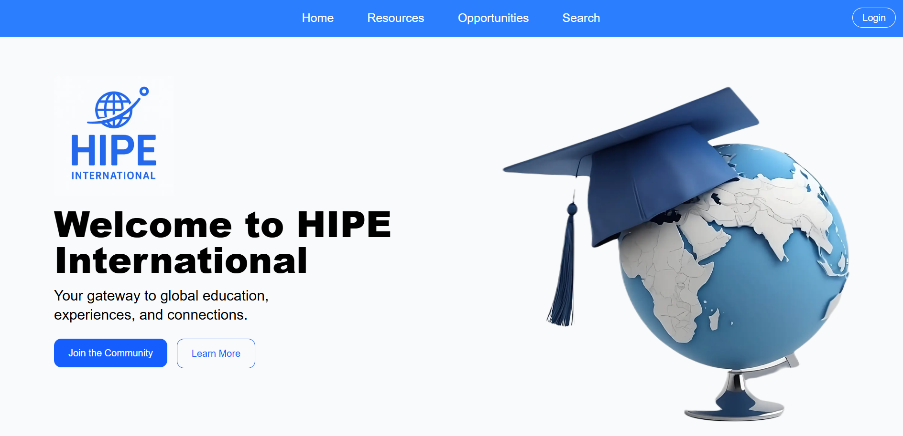

# 🌍 International Education Opportunities Platform

A full-stack web platform designed to connect **students**, **faculty**, and **organizations** with international education opportunities such as **study abroad programs, scholarships, internships, and research projects**.

Built with **Next.js**, **MongoDB**, **Tailwind CSS**, and **Firebase**, this platform provides a modern, user-friendly experience while enabling role-based onboarding and personalized access to relevant opportunities.

---

# 🌐 Live Deployment:
https://hipe-community.vercel.app/

## 🚀 Features

### 🔹 Role-Based Onboarding
- **Students**: Explore opportunities, save favorites, and customize search filters.
- **Faculty/Staff**: Share mentorship, research, or program opportunities with students.
- **Organizations**: Post opportunities and connect with targeted audiences.

### 🔹 Opportunity Management
- Post, edit, and manage listings for international opportunities.
- Search and filter from a database of 200+ opportunities.
- Save favorite opportunities for quick access.

### 🔹 Modern UI/UX
- Clean, responsive design with **Tailwind CSS**.
- **Selectable buttons** for streamlined navigation.
- Smooth **animations and hover effects** for better interactivity.
- Mobile-first layout ensuring accessibility on all devices.

---

## 🛠️ Tech Stack

- **Frontend:** [Next.js](https://nextjs.org/) + [Tailwind CSS](https://tailwindcss.com/)
- **Backend:** [Node.js](https://nodejs.org/) + [MongoDB](https://www.mongodb.com/)
- **Authentication & Hosting:** [Firebase](https://firebase.google.com/)
- **Deployment:** [Vercel](hipe-community.vercel.app/)

---

## 📸 Screenshots

| Onboarding Flow | Opportunity Search |     Home Page     |
|-----------------|--------------------|-------------------|
| *(Insert Image)* | *(Insert Image)*   |   |

---

## 📌 Roadmap

- [ ] **Forum** – Enable discussion posts and threaded comments.
- [ ] **Messaging** – Direct communication between users.
- [ ] **Resource Sharing** – Post and share relevant opportunities & materials.
- [ ] **Application System** – Apply directly to posted opportunities.

---

## 📂 Getting Started

1. **Clone the repository**
   ```bash
   git clone https://github.com/your-username/repo-name.git

2. **Navigate to the project folder**
3. **Install dependencies**:
   npm install

4. **Run server**
   npm run dev
